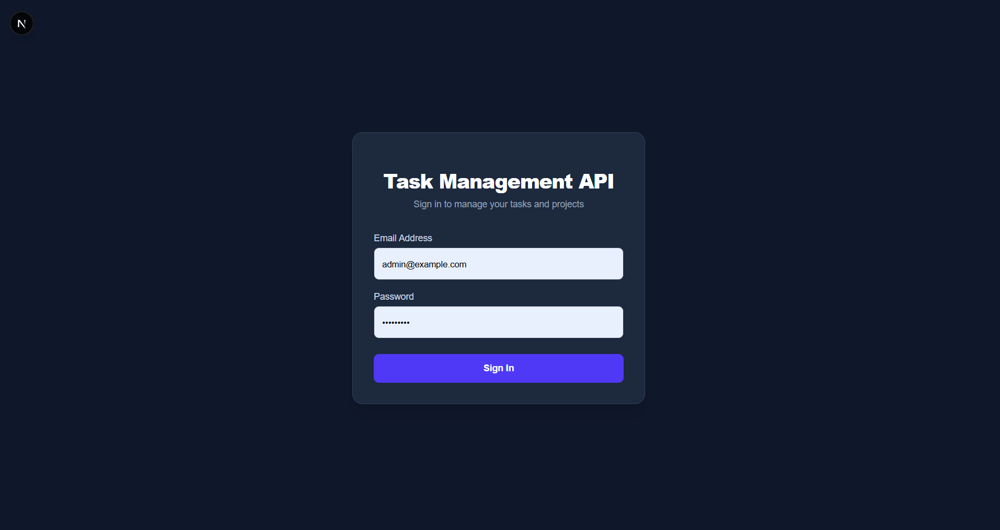
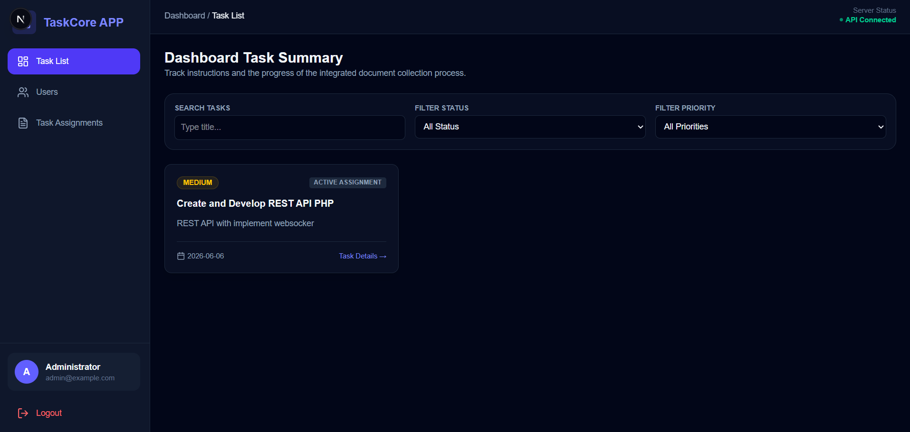
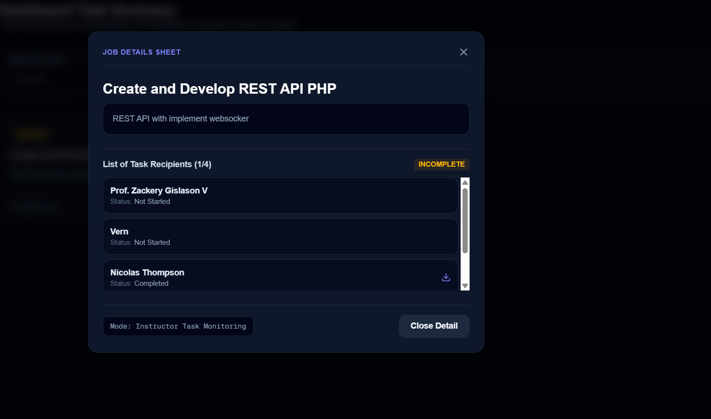
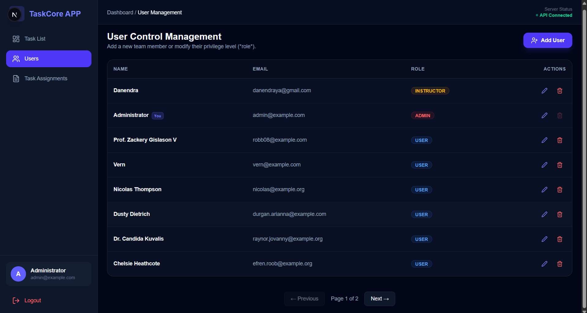
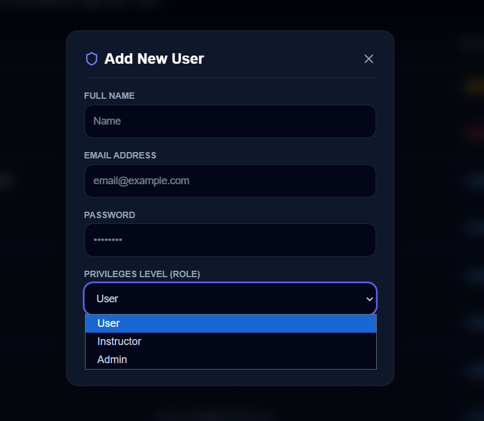
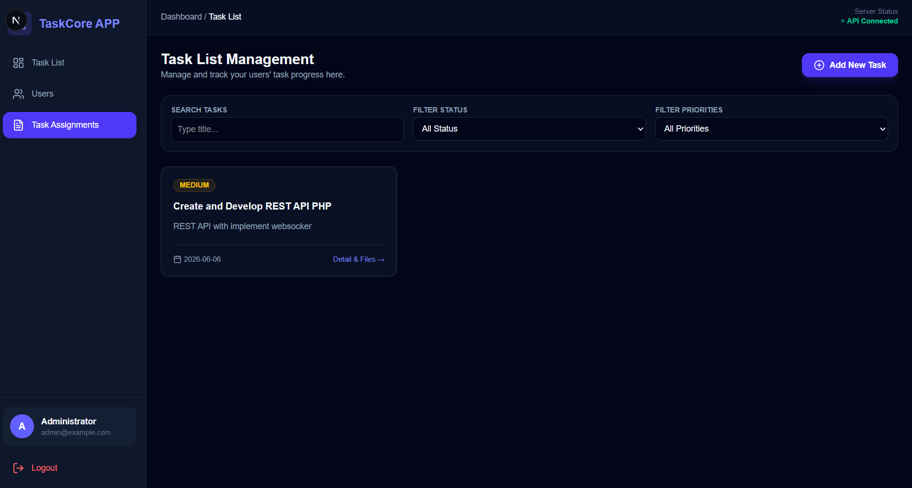
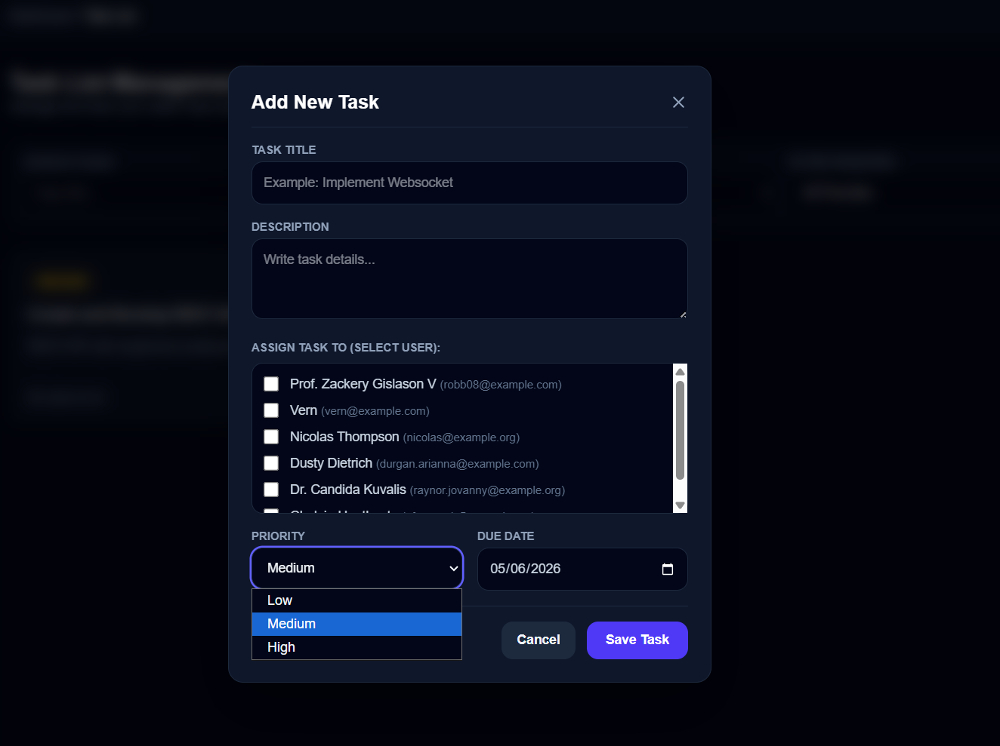
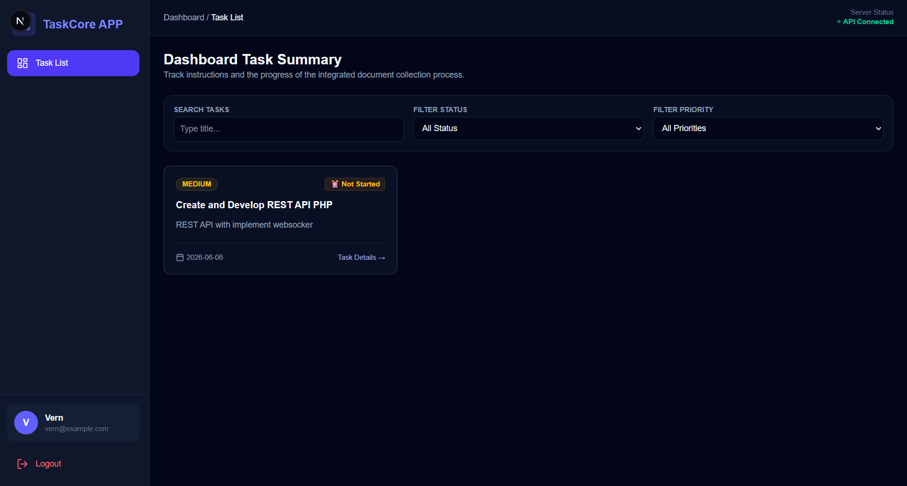
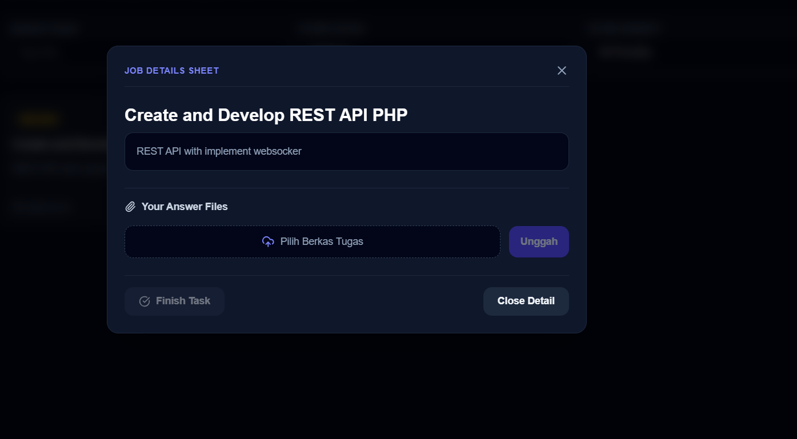

# Task Management Platform - Technical Assessment

## 📌 Overview
This is a full-stack implementation project for a Task Management platform built as part of a Technical Assessment. 
The application separates concerns between a backend RESTful API using **Laravel 11** and a modern interactive frontend using 
**Next.js 15 (App Router)** with **TypeScript** and **Tailwind CSS**.

The system meets the requested industry-standard minimum requirements, including database performance optimizations, 
secure file upload handling, background job processing, and a responsive user interface.

---

## 📂 Project Structure
The project is organized as a clean monorepo with a clear separation between server and client sides according to the submission guidelines:

```text
transcosmos_assesment_danendra/
├── backend/                  # RESTful API (Laravel 11 & PHP 8.2+)
│   ├── app/                  # Core logic (Controllers, Models, Jobs)
│   ├── config/               # Application configuration
│   ├── database/             # Migrations, Seeders, and SQL Dump
│   │   └── transcosmos_db.sql # DB Dump: Schema + Sample Data (Test rules)
│   ├── routes/               # API endpoint definitions
│   └── README.md             # Backend-specific notes
├── frontend/                 # Client SPA (Next.js 15 + Tailwind CSS)
│   ├── app/                  # Next.js App Router (Pages & Components)
│   │   ├── components/       # Reusable UI (Dashboard layout, etc.)
│   │   ├── login/            # Client authentication features
│   │   └── utils/            # Axios API engine & interceptors
│   ├── public/               # Static files & frontend assets
│   └── README.md             # Frontend-specific notes
└── README.md                 # Main project documentation (this file)
```

## 📸✨ Application Feature Preview

1. login page

<p align="center">
  
</p>

The first screen that appears when the website is opened is the login page, 
which displays the email address and password for logging into the system

2. Dashboard Landing Page

<p align="center">
  
</p>

After the user login, the menu will take them to the main dashboard page. The left side displays a sidebar for menu navigation, 
the login button, and the logout button. The header shows whether the API is connected or not. 
The center section displays the assignment page content.

3. Task Assigment List (Admin & Instructor View)

<p align="center">
  
</p>

The task list view for administrators and instructors displays a list of users based on their assignments. 
The view also shows which users have submitted attachments or completed their assignments. 
The task list menu includes a filter to display data based on selected criteria.

4. User Management Menu (Only Administrator)

<p align="center">
  
</p>

The page for managing users includes features for adding new users, editing users, and deleting users

5. Add New User

<p align="center">
  
</p>

When creating a new user, the administrator can specify the user's role level for the system 

6. Task Assignment Management Menu

<p align="center">
  
</p>

A menu for managing and creating new assignments for users. 
Administrators and instructors can create new assignments intended for anyone who will be working on that assignment

7. Create New Task

<p align="center">
  
</p>

In the section for creating a new assignment, administrators or instructors can set the priority level for assignment submission and the deadline. 
The page for adding a new assignment also displays all registered users in the system so that assignments can be assigned to each of them.


8. Task List Menu Dashboard (User View)

<p align="center">
  
</p>

On the user's task list assignment dashboard page, the page displays all the tasks assigned to the user. 
It includes indicators showing whether a task has been completed or not, 
the specified deadline, and the priority level of the tasks to be completed.

9. Completion of Assigned Task (User View)

<p align="center">
  
</p>

There is a task submission form for users to complete their assignments. Submissions can be in the form of files, videos, or images. 
Once a user has completed an assignment, they can click the “Finish Task” button to indicate that the assignment has been completed.
